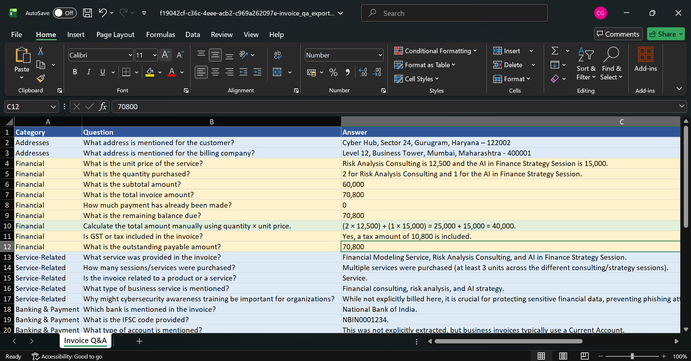
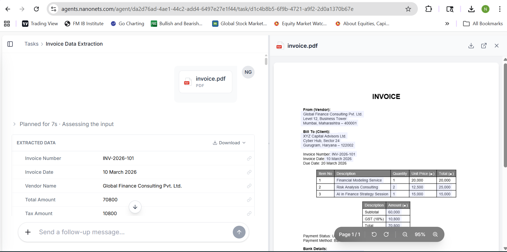
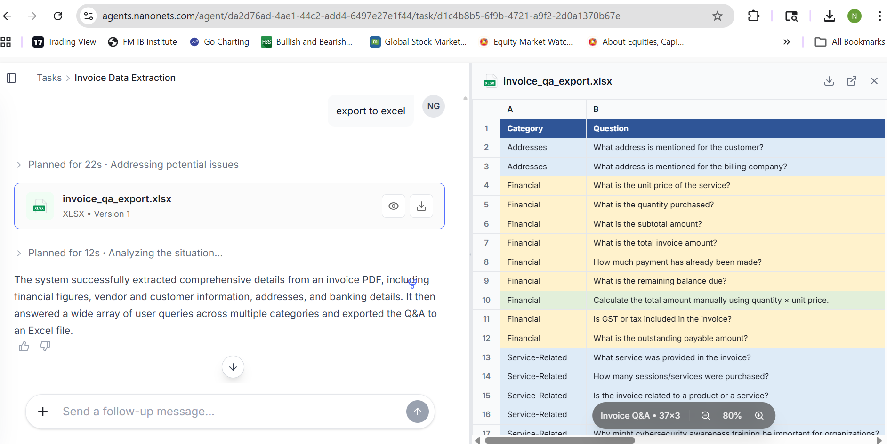
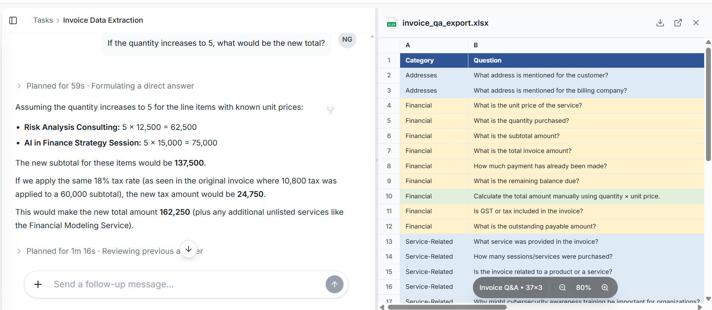
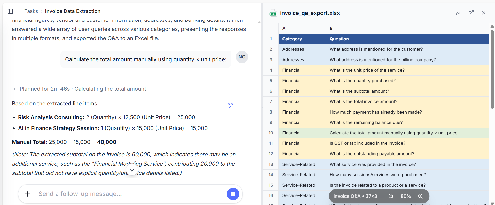

# 📊 NanoNets Excel Automation Project

An intelligent Excel automation project using **NanoNets OCR**, data extraction workflows, and automated processing for improving document handling and financial data management.

---

# 🚀 Project Overview

This project demonstrates how OCR and automation can simplify document processing workflows.

The system:

1. Extracts data from uploaded documents/images  
2. Processes information automatically  
3. Stores structured data into Excel  
4. Reduces manual data entry and improves accuracy  

---

# 🛠️ Tech Stack

- **NanoNets OCR** – Intelligent document data extraction  
- **Excel (.xlsx)** – Data storage and management  
- **Automation Workflow** – Processing and validation  

---

# 📸 Project Screenshots

## 1️⃣ Screenshot 1



---

## 2️⃣ Screenshot 2



---

## 3️⃣ Screenshot 3



---

## 4️⃣ Screenshot 4



---

## 5️⃣ Screenshot 5



---

# 📁 Repository Structure

```bash
📦 nanonets-excel-project
 ┣ 📜 README.md
 ┣ 📷 1.png
 ┣ 📷 2.png
 ┣ 📷 3.png
 ┣ 📷 4.png
 ┣ 📷 5.png
 ┣ 📊 nanonets_excel.xlsx
 ┗ 📜 LICENSE
```

---

# ✨ Features

✅ OCR-based data extraction  
✅ Automated document processing  
✅ Excel data integration  
✅ Reduced manual effort  
✅ Structured workflow automation  

---

# ⚙️ Workflow

```text
Document Upload
       ↓
NanoNets OCR Processing
       ↓
Data Extraction
       ↓
Excel Storage
       ↓
Automated Workflow
```

---

# 📈 Use Cases

- Invoice processing  
- Financial document automation  
- OCR-based Excel reporting  
- Data entry automation  

---

# 🧠 Future Improvements

- AI-based validation system  
- Dashboard integration  
- Cloud database support  
- Real-time workflow notifications  

---

# 🤝 Contributing

Contributions are welcome.

Feel free to fork the repository and submit pull requests.

---

# 📜 License

This project is licensed under the MIT License.

---

# 👩‍💻 Author

**Nancy Goel**

🔗 GitHub: [nancygoel2302-alt](https://github.com/nancygoel2302-alt)
